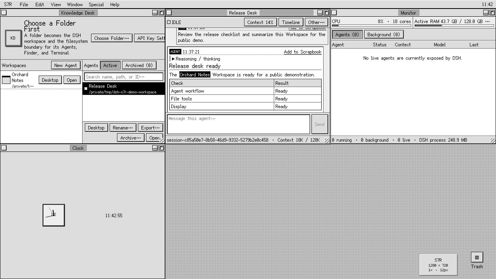
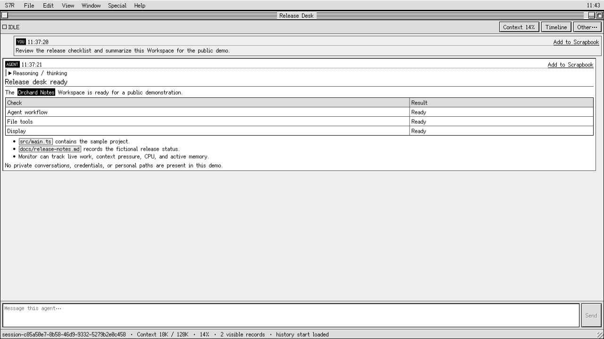
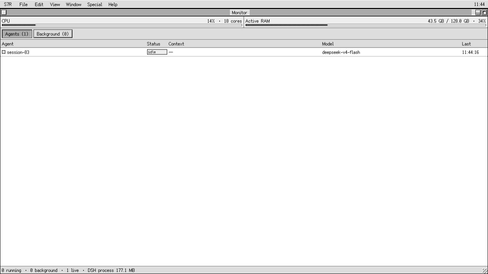
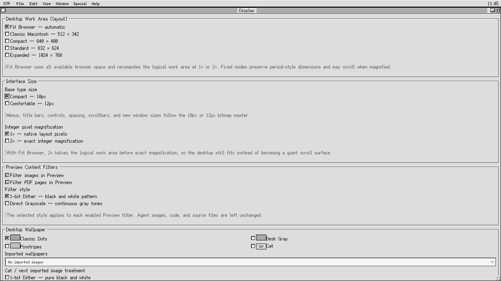
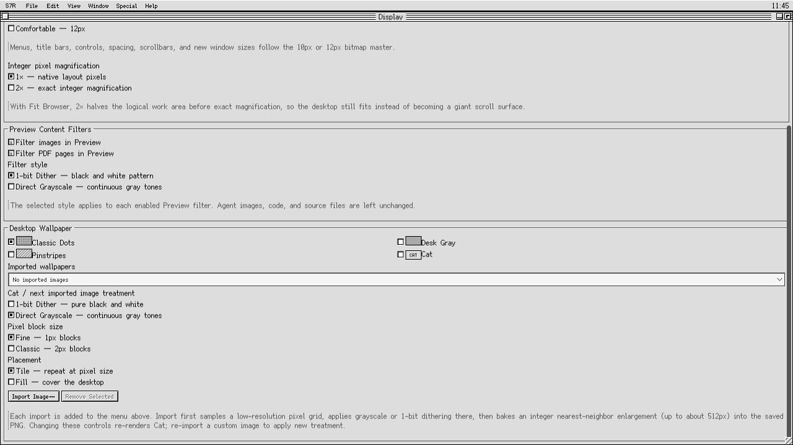

# S7R — System 7 Reimagined for DeepSeek Harness

[](https://github.com/hunter118/dsh-s7r/actions/workflows/ci.yml)
[](https://github.com/hunter118/dsh-s7r/releases/latest)
[](./LICENSE)
[](./COMPATIBILITY.md)

S7R is an original System 7-era workstation shell for the [DeepSeek Harness](https://github.com/deepseek-ai/deepseek-harness) Web UI. It turns real DSH Agents, Workspaces, files, terminal sessions, tools, and persisted history into a coherent multi-window desktop instead of placing a retro skin over a chat page.

**S7R** is the desktop environment. **Knowledge Desk** is its Workspace, Agent, and conversation application.



> [!IMPORTANT]
> S7R currently targets DSH `0.1.0-rc.7` exactly. DSH is in developer preview and later releases may require adapter updates. See [Compatibility](#compatibility-and-known-limitations).

## Highlights

- Real DSH Agent streaming, reasoning, tools, attachments, history, steering, cancellation, and persisted sessions
- Native Workspace folder selection and a Finder/TextEdit/Preview workflow contained to that Workspace
- Real owner-scoped `/bin/zsh` Terminal with retained low-latency output
- Timeline folding, system/background Monitor, context pressure inspection, compaction, and summarized Agent handoff
- Agent search, rename, export, reversible archive/restore, completion notifications, and optional safe Markdown rendering
- Global Find across file names, source contents, conversation messages, or every persisted Agent event
- Restorable multi-window desktop with draggable aliases, marquee multi-select, group movement, and alias-only Trash
- Scrapbook, Clock, solvable 4×4 Puzzle, Display control panel, seamless Cat wallpaper, and imported wallpaper processing
- Native 10px/12px Simplified Chinese bitmap fonts, exact 1×/2× magnification, grayscale depth, and hard pixel edges
- Secure `DEEPSEEK_API_KEY` setup through DSH's write-only credential service

## Requirements

- Node.js `22.19+` or `24+`
- DeepSeek Harness `0.1.0-rc.7`
- pnpm for DSH profile plugin management and source development
- A modern Chromium-based DSH Web UI browser is the primary tested target

## Install

### Prebuilt release

Download `dsh-s7r-0.7.0.tgz` from the [latest GitHub Release](https://github.com/hunter118/dsh-s7r/releases/latest), then install it into the DSH Web profile:

```sh
dsh plugin --profile web add ./dsh-s7r-0.7.0.tgz
dsh --profile web --dump-config
dsh web
```

Open the loopback URL printed by DSH, normally `http://127.0.0.1:3080`.

The Release also contains `SHA256SUMS`. Verify the downloaded archive on macOS with:

```sh
shasum -a 256 -c SHA256SUMS
```

On Linux, use `sha256sum -c SHA256SUMS`.

### Install from source

```sh
git clone https://github.com/hunter118/dsh-s7r.git
cd dsh-s7r
pnpm install --frozen-lockfile
pnpm check
pnpm build
dsh plugin --profile web add .
dsh web
```

### Remove or replace

```sh
dsh plugin --profile web remove dsh-s7r
```

Remove the installed version before adding a different tarball. S7R's browser-local display, desktop, and Scrapbook preferences may remain in that browser profile; real DSH Workspace files and session logs are not removed.

## First run

1. Open **S7R → Settings…**. If DSH does not already receive `DEEPSEEK_API_KEY` from its launch environment, save it here. S7R can report configured/source/writable state but cannot read the stored value back.
2. Choose **File → Choose Folder…**. The native DSH picker registers that external directory as a Workspace before an Agent begins work.
3. Use Knowledge Desk to create, search, reopen, rename, archive/restore, or export Agents.
4. Use **File → New Terminal** for zsh even when Finder and every Agent window are closed.
5. Open **Help → S7R Guide…** for the same compact workflow reference inside the workstation.

Browser-owned shortcuts such as Command-N and Command-W are intentionally not advertised because a page cannot reliably override the browser tab.

## Knowledge Desk and Agents

Knowledge Desk is both a Workspace launcher and an Agent browser. It searches by Agent name, Workspace path, or ID; restores S7R-archived conversations; and connects windows to the real DSH `SessionRuntime` rather than duplicating chat state.



Every Agent window keeps a compact single-line toolbar:

- **Context** opens provider-reported token length/percentage when available, estimated shares for user/assistant/reasoning/tools/Workspace material, 75%/90% warnings, **Compact Now**, and **New Agent with Current Summary**.
- **Timeline** opens the complete live or cold persisted event ledger. Adjacent same-type events such as `assistant/chunk` fold into expandable runs.
- **Other…** provides rename, complete Markdown/JSON export, reversible archive, desktop placement, and a persistent Markdown-rendering toggle.

Completed output can safely render headings, emphasis, inline/fenced code, lists, quotes, and tables. Streaming stays plain text, raw HTML is never injected, and LaTeX stays source text. Color Emoji are normalized to monochrome pixel-font symbols or short text without changing stored conversation data.

## Workspaces, Finder, TextEdit, and Preview

Finder reads the selected session's canonical Workspace through DSH. Every host path is resolved again and rejected if it escapes that root.

- Double-click folders to navigate.
- Text and source files open in TextEdit.
- Images and PDFs open in Preview.
- TextEdit saves use the last-read filesystem version and surface concurrent changes instead of overwriting them silently.
- Preview has page, zoom, fit, and temporary **Inspect Original** controls.

Display can filter Preview images and PDF pages through either ordered 1-bit black/white dithering or direct luminance grayscale. Filtering is cached, non-destructive, and never rewrites the source file.

## Terminal

Terminal uses the official DSH terminal service and shell backend with `/bin/zsh -f -i`. DSH owns process spawning, sandbox policy, scrollback, signaling, terminal identity, and Agent ownership. S7R acknowledges submitted lines immediately and polls retained foreground output without overlapping reads.

When no Agent is active, S7R creates a fresh blank live owner in the current/recent Workspace rather than requiring a visible Agent window.

DSH rc.7 is line-oriented: it does not expose a raw browser keystroke stream or post-spawn PTY resizing. Terminal therefore behaves like a responsive real line console, not an xterm-style raw attachment.

## Find, Timeline, and Monitor

**File → Find…** has independent search depths:

- file and folder names;
- source/text contents;
- visible conversation messages;
- every persisted event, including tools, reasoning, and context records.

Matches route to Finder/TextEdit/Preview, the Agent, or the exact Timeline event. Traversal stops at 5,000 files, skips hidden and `node_modules` directories, reads at most 1 MiB per source file, and returns at most 200 results.



Monitor combines:

- live Agent state and model;
- DSH background jobs;
- latest provider-reported context pressure;
- host-wide CPU and active RAM;
- DSH process RSS.

On macOS, inactive/file-cache pages are excluded from active RAM so reusable cache does not appear as application pressure. Minimal desktop notices appear only when an Agent crosses into a completed state; selecting one opens that Agent.

## Desktop workflow

Window bounds, z-order, zoom/collapse state, desktop aliases, reversible Agent archives, Trash, and Markdown preference survive reload. Terminal windows are the intentional exception because serialized windows cannot safely reattach live owner-scoped PTYs.

Workspaces, Agents, Finder items, and individual Scrapbook cards can become desktop objects. Drag empty desktop space to marquee-select several aliases and drag any selected alias to move the group.

Folders have two explicit desktop meanings:

- **Finder Alias** opens the directory within its existing Workspace.
- **Workspace Alias** registers the directory as a Workspace and connects its Agent.

Delete/Backspace or a drop on Trash moves only aliases into S7R's reversible Trash. **Put Away** restores them; **Special → Empty Trash…** permanently discards aliases only. Real files, Workspaces, Agent logs, and Scrapbook cards are never deleted by desktop Trash.

Paths dropped into an Agent become portable `./relative/path` references when they are inside that Agent's Workspace and remain absolute otherwise.

## Scrapbook and desk accessories

Scrapbook stores browser-local editable cards with source references. Agent capture links retain a visited state, and each card has one-click copy. Individual cards can be placed on the desktop.

Clock is a live analog/digital desk accessory. Puzzle is an original 4×4 sliding-number implementation; shuffling performs only legal moves, so every generated board is solvable.

System applications and preferences live in their workflow menus. Clock and Puzzle remain in the S7R application menu as desk accessories.

## Display and wallpaper



Display separates four concerns:

- **Logical work area:** Fit Browser, Classic 512×342, Compact 640×480, Standard 832×624, or Expanded 1024×768
- **Interface size:** Compact 10px or Comfortable 12px, each with matching discrete control/window metrics
- **Pixel magnification:** exact 1× or 2× layout magnification with inverse pointer mapping
- **Content filters:** optional Preview image/PDF processing in 1-bit or grayscale

Classic Dots is the default wallpaper. Desk Gray, Pinstripes, seamless Cat, and imported images are also available. Cat and imports are sampled onto a genuine low-resolution grid, filtered, and baked into an integer nearest-neighbor PNG. Imports accumulate in a named library and can tile at native pixel size or fill the desktop. The source image is not retained after processing.



## Persistence and data ownership

S7R stores versioned browser-local records for display preferences, imported wallpaper, Scrapbook cards, window/desktop state, reversible archives, Trash, and Markdown preference. Malformed records fail closed and known older formats migrate explicitly.

DSH remains authoritative for Agents, conversations, Workspace registration, files, terminal ownership, tools, and background jobs. Closing an Agent window never deletes its DSH session.

## Security model

- Credential status and mutation use DSH's official loopback-only service; stored secrets are write-only from the browser's perspective.
- Package-specific host RPC is loopback-authorized and validates identifiers.
- Every file request is contained under the selected live or persisted Workspace root.
- Existing-file saves require the version returned by the previous read.
- Binary reads are capped at 25 MiB.
- Terminal IDs remain owner-scoped through DSH.
- Markdown rendering creates React nodes from a restricted grammar and never injects raw HTML.

Please report credential exposure, path traversal, unsafe writes, terminal ownership errors, or injection privately as described in [SECURITY.md](./SECURITY.md).

## Compatibility and known limitations

This release was developed against official DeepSeek Harness commit `99f6f02fecdb7dff40c3fbc9470f5907c29f74ca` (`0.1.0-rc.7`, inspected 2026-08-17). Exact adapter seams are documented in [COMPATIBILITY.md](./COMPATIBILITY.md).

- DSH rc.7 has fixed backend PTY dimensions and no supported resize method or raw browser byte stream.
- TextEdit is a robust plain text/code editor, not a language server or syntax-highlighting IDE.
- Preview renders raster PDF pages but has no selectable PDF text layer.
- DSH exposes archive but no public unarchive API. S7R therefore uses a reversible local hide/archive layer for new actions; older DSH-native archived IDs cannot be restored through a supported seam.
- The S7R client intentionally replaces the root slot; native DSH surfaces remain installed but are not mixed into the simulated desktop.

## Development

```sh
pnpm install --frozen-lockfile
pnpm check
pnpm pack
```

`pnpm check` runs strict host/client TypeScript checks, 59 deterministic tests, and production host/client bundles. PDF.js and its worker implementation are embedded so Preview needs no CDN or runtime network dependency.

Project references:

- [Architecture](./ARCHITECTURE.md)
- [Compatibility notes](./COMPATIBILITY.md)
- [Product and design specification](./docs/design-spec.md)
- [Development notes](./docs/development-notes.md)
- [Changelog](./CHANGELOG.md)
- [Contributing](./CONTRIBUTING.md)

## License and asset provenance

S7R is MIT licensed. It is an independent project and is not affiliated with or endorsed by Apple Inc. or DeepSeek. No Apple artwork, system files, proprietary fonts, sounds, screenshots, or extracted resources are bundled. Icons and patterns are original CSS/text constructions; the Cat wallpaper is an original generated bitmap processed by S7R's local grayscale pipeline.

The browser bundle includes Simplified Chinese 10px/12px faces from **Fusion Pixel Font** under SIL OFL 1.1 and **PDF.js** under Apache-2.0. Copyright notices and full license texts are included in [THIRD_PARTY_NOTICES.md](./THIRD_PARTY_NOTICES.md) and [`THIRD_PARTY_LICENSES/`](./THIRD_PARTY_LICENSES/).
